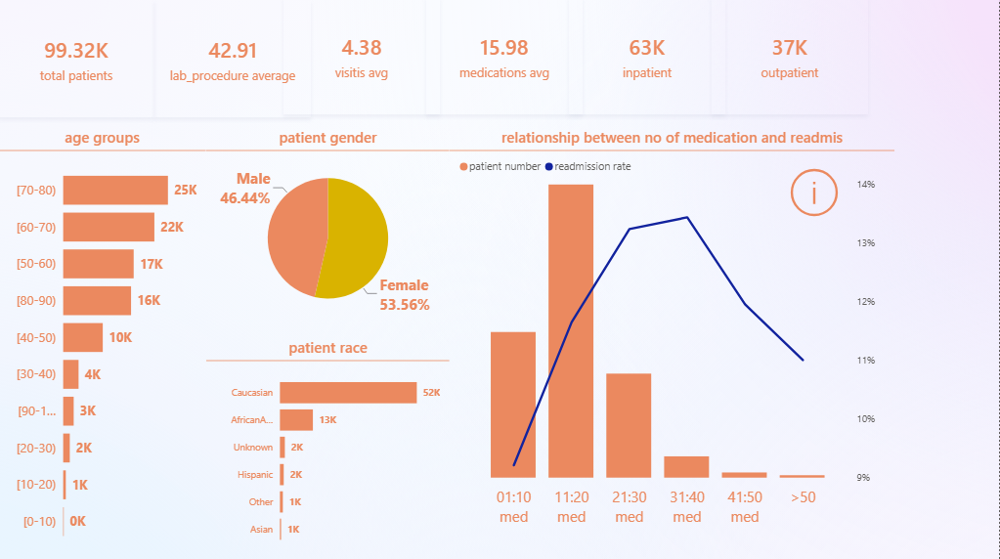
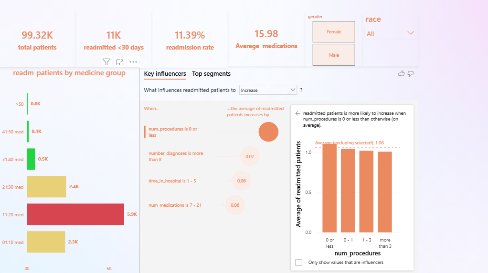

# healthcare_diabetes
healthcare analysis
# Diabetes Patient Analytics & Readmission Dashboard 🏥📊

**Author:** dr mahmoud amer | Data Analyst and Pharmacist

## 🎯 Project Overview
This Power BI project provides a comprehensive analysis of diabetic patients, focusing on general patient overview, retention, and the critical factors driving hospital readmissions. The dashboard is designed to help healthcare administrators identify high-risk patient segments and improve care quality.
## 📸 Dashboard Previews

### 1. General Overview & Patient Retention
Provides a high-level summary of the diabetic patient population, average medications, and discharge details.


### 2. Readmission Analytics & AI Insights
Focuses on the 30-day readmission rate. This page features conditional formatting to highlight the most vulnerable patient groups and uses AI to explain the primary drivers behind increased readmission rates.


## 📁 Files Included
* **`diabetes.pbix`**: The fully interactive Power BI desktop file containing the data model, DAX measures, and visuals.
* **`diabetes.pdf`**: A static, high-quality export of the dashboard for quick viewing and presentations.

## 🗄️ Data Cleaning & Preprocessing (PostgreSQL)
Before loading the data into Power BI, the raw dataset underwent rigorous cleaning and structural formatting using **PostgreSQL** via **DBeaver** to ensure data integrity and accuracy. 

Key SQL data preprocessing steps included:

* **Schema Creation & Batch Import:** Designed the relational database schema and successfully managed the batch import of raw CSV files into PostgreSQL, resolving structural anomalies.
* **Handling Missing & NULL Values:** Identified and handled missing data in critical demographic and clinical columns (e.g., replacing NULLs in the `race` or `medical_specialty` columns with 'Unknown' or applying appropriate imputation).
* **Data Type Standardization:** Casted categorical strings and numerical identifiers to their optimal data types to reduce model size and improve Power BI rendering speed.
* **Data Transformation:** Standardized inconsistent text entries (e.g., lowercasing, trimming whitespaces) and filtered out invalid or outlier records that could skew the readmission metrics.

**Sample SQL Cleaning Query:**
```sql
-- Example of standardizing patient records and handling nulls
UPDATE diabetic_data
SET 
    race = COALESCE(NULLIF(TRIM(race), '?'), 'Unknown'),
    gender = UPPER(TRIM(gender)),
    readmitted = CASE 
                    WHEN readmitted = '>30' THEN 'Yes (>30)'
                    WHEN readmitted = '<30' THEN 'Yes (<30)'
                    ELSE 'No' 
                 END
WHERE gender != 'Unknown/Invalid';
